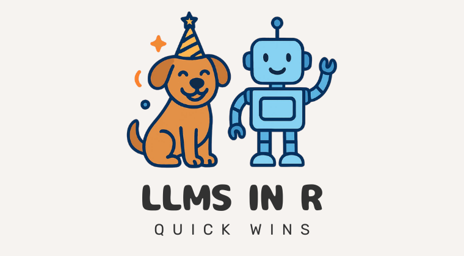
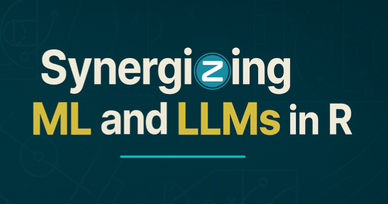

## Online Courses

### LLMs in R: Quick Wins

[{fig-align="center" width="70%"}](https://www.aifordatapeople.com/courses/llms-in-r)

Learn how to use Large Language Models in R with the ellmer package. Extract tidy data from messy text, and create your own chatbot!

### Athlyticz: ML and LLMs in R - out soon

[{fig-align="center" width="70%"}](https://athlyticz.com/ai-signup)

A comprehensive course I developed with Christoph Scheuch covering the full journey from machine learning fundamentals to building LLM-powered applications in R.

The course covers:

-   ML foundations with tidymodels: model evaluation, resampling, tuning, preprocessing
-   Regression and classification models including neural networks
-   Model deployment with vetiver and orbital
-   Working with LLMs using ellmer
-   Retrieval-augmented generation (RAG) for building apps with your own data

Aimed at R users comfortable with the tidyverse who want to build and deploy ML and LLM applications.

## Live courses

### Big Data in R with Arrow and Parquet

**Learn Arrow and Parquet to make large-scale analysis fast, reliable, and reproducible.**

Data analysis pipelines with larger-than-memory data are becoming more and more commonplace, but it's not uncommon to hit a wall when data gets too big for your R session. CSVs end up taking forever to load, and even when they do, analyses grind to a halt. This course shows you how to handle big data in R using open, modern tools.

### What you'll learn

-   Analyse larger-than-memory data without learning new syntax: Use {arrow} with {dplyr} to query millions of rows without crashing R
-   Exercise fine control over data types to avoid common large data pipeline problems
-   Convert messy CSVs into space-saving, shareable Parquet files
-   Optimise Arrow datasets to take full advantage of your hardware
-   Build reproducible workflows using formats and tools designed for long-term reliability

### Book a workshop

There are no public dates currently scheduled. If you're interested in attending a future session or booking private training for your team, get in touch at [nic\@ncdatalabs.com](mailto:nic@ncdatalabs.com).

### Who is this course for?

This course assumes you have basic knowledge of dplyr syntax. It's for you if you:

-   want to learn how to work with tabular data that is too large to fit in memory using existing R and tidyverse syntax implemented in Arrow
-   want to learn about Parquet and other file formats that are powerful alternatives to CSV files
-   want to learn how to engineer your tabular data storage for more performant access and analysis with Apache Arrow

### Testimonials

> "I had the privilege of attending Nic Crane's 'Big Data in R with Arrow' workshop, and it fundamentally changed how I approach large-scale data processing. Despite having worked with Arrow and DuckDB for a couple of years prior, Nic's workshop gave me a much deeper understanding of the relationship between Parquet file management and optimizing data processing with Arrow. What stands out most about Nic as an instructor is their ability to take complex technical concepts and make them not just comprehensible, but genuinely exciting to learn."
>
> — Javier Orraca-Deatcu, Lead Machine Learning Engineer at Centene
