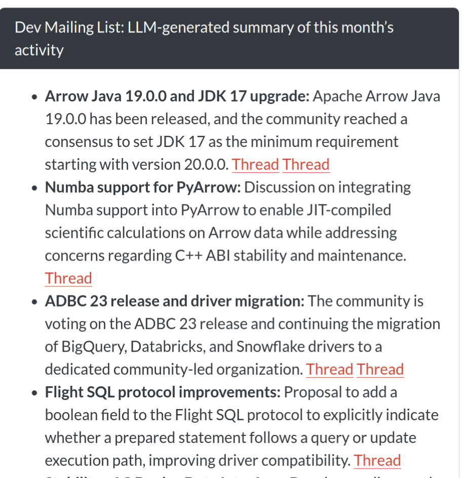

I want to write more blog posts but it takes me too long to write and edit something. I didn't want to write with AI, so instead had GPT 5.4 interview me, record my responses verbatim, and then I manually tidied up the speech-to-text and cut out repetition or waffle, so while this post is AI-augmented, it's still human-written.

## When did AI start to feel genuinely useful to you on Arrow?

🤖 Summary: The mailing-list summariser was one of the first times AI felt genuinely useful on Arrow because it solved a real problem cheaply. Rather than trying to outsource core project work, they used AI to help build a small support tool that was low-stakes, easy to keep around, and immediately useful in their day-to-day work.

> So I feel that mailing list summariser is one of the most interesting projects I did, because it was a little one-and-done thing that I still use to this day.

{fig-align="center" width="366"}

> We have some code that grabs the Arrow mailing list and works out all the threads and summarises what's going on in the project. It runs every night, so it's a single LLM call once it has the relevant data.

> I think AI can be great for code, but it's all the peripheral tasks where I find it most exciting to use it.

> Even the code for the summariser was generated with Claude, because it's quite tricky to parse the files and then put the different conversation threads back together. It wouldn't have been worth the time that I would have invested writing the code myself because it would have taken me ages, whereas generating this code doesn't have to be nice as long as it works, which is different to the actual project code.

> I also got to learn a bit about prompt engineering, and how AI is great for summaries, especially in low stakes outputs like this.

## What problem were you trying to solve with the mailing-list summariser?

🤖 Summary: The summariser was not mainly about raw productivity. Its real value was giving them a high-level picture of what was happening across a large project, especially outside the parts of the codebase they already knew well, and helping them feel more connected to the wider Arrow community.

> I was trying to understand at a high level what was going on across the project; it was hard to do it because there are lots of different people, lots of different threads, and you can subscribe to them as emails but it's hard to know a high level overall what is going on.

> Especially in areas of the code base that I'm not familiar with, so having it in one place to skim and figure out where to dig into more is great.

> It helped me feel more connected to the project, and in some ways I probably felt more comfortable mailing the mailing list myself, because I didn't feel like my topic was off on some tangent, or nothing whatever else was talking about.

## What's a concrete example of AI helping you get a real engineering win?

🤖 Summary: The benchmark investigation is a good example of AI producing a concrete engineering gain rather than just a vague feeling of speed. The useful part was not that the model magically knew the answer. It was that it made a large, boring, ambiguous log-analysis task tractable enough to be worth doing, which then led to a measurable runtime improvement.

> So we've got benchmarks that we've run on Arrow because it's such a complex code base. We need to be able to go further than just  unit tests; we also make sure we haven't introduced any performance regressions, and so we actually run benchmarks in every single PR. These benchmarks are huge and wide ranging, so they're using complex analytical queries and take hours to run, so you'll only get the benchmark running on that PR a while after it's been merged.

> I wanted to see if I could speed up the benchmark run times, I can't even remember why I was doing it now. I think I wanted to check if anything had slowed down recently, and when I was going through the logs, I got Claude to analyse how long each subtask was taking. From that I learned that installing the R setup stuff was really slow. And what had happened was that we'd been installing from source packages rather than binary packages. From discovering that I ended up making a change to both the benchmarks repo and the Arrow code. And now it's used Posit Public Package Manager to install binaries.

> I managed to get the benchmark runtime down by about 50 minutes.  It's still a long benchmark to run; it takes 6-7 hours, so I was pretty happy with shaving 50 minutes off that.

> I think I wouldn't have even taken on that task if I wasn't using AI, because it's pretty tedious going through logs like that, and it would have taken so long for unclear rewards. Whereas this now effectively allows me to explore things and do these in-depth explorations of otherwise time-consuming things because the stakes are much lower.

## When you say you use Claude for coding on Arrow, what does that mean in practice?

🤖 Summary: Their workflow with Claude is not "tell it to fix the bug and trust the result." The useful pattern is narrower and more supervised: use it to help locate the issue, explain unfamiliar code, surface assumptions, and implement small directed steps while they stay actively involved in the review process.

> I will find a bug that needs fixing, and I'll have a look with Claude. I'll break things down into steps, and get it to find the source of the bug. I'll get it to show me where in the codebase it thinks the issue is. I'll check it myself, have a think, and make sure that it feels right to me. I might get it to explain what and why, and iterate a bit, because although it makes mistakes it doesn't tend to lie and double down, so even if it gets something wrong you can figure it out.

> And then I'll ask it to tell me all the assumptions it's basing its opinions on, or I might point it in a particular direction to find out more information. Then once I'm comfortable that we've properly triaged the bug, and we do know the source, then I'll look for the potential solution.

> Again, I'll probably direct it. I won't just say "right, fix this". If there's three things that need doing, I'll specifically name those three things. I'll repeatedly review the code as it's going, and iterate on that.

> And then just really basic stuff like making sure it always generates tests. And one phrase I keep having to use is telling it to be "idiomatic", so in other words, asking it to do things in the same style as the rest of the codebase. I think making it realise that the rest of the code base is well verified helps me get a better answer.

## What part of that coding workflow feels most valuable?

🤖 Summary: The biggest gain is not just raw speed. It is that AI lowers the activation energy for maintenance work that matters but is easy to avoid. That includes boring fixes, fiddly error-message work, and other tasks that are worth doing but often hard to start when they feel annoying or uncertain.

> Reducing the amount of cognitive effort it takes to do some boring fix. I'm not having to motivate myself to do it, because I get the joy of getting it done, without the risk of going down completely down the wrong path and having to change everything, so I genuinely think it makes me a lot more productive in that way.

> There's also things where I wrote tickets ages ago to fix some unhelpful error message, but then realized it was a few layers deep in the codebase and so just let the ticket linger, but it's really important to keep on top of the user experience stuff, so it's nice to get back on that.

## Can you give an example of AI helping you work in an area you weren't already fluent in?

🤖 Summary: AI can be especially useful when it helps them work in an area that is outside their usual comfort zone. In this case, it helped them respond to changes around R's C API, add earlier CI detection, and make the required package change, while still leaving the final design choice with them.

> Yeah so recently the underlying functions from R's C API that you're allowed to use in R packages had some changes, and you're no longer allowed to use certain functions. So I noticed that this had changed and I did two things here.

> The first thing was that I added a job to our continuous integration. We have CI jobs that run every night. So I added a step to one of our nightly CI jobs to alert us when this happens so that we don't just find out when CRAN emails us, because sometimes we want a little bit longer lead time than that. We want to know as soon as it's changed.

> And then another thing that I did was to make a change to the code in the Arrow R package itself. Honestly I'm not super familiar with R's C API, so I used AI to help me make that PR. And as I went through, I also asked it what it was doing, and why it was doing it, and how it was doing it. And it helped me quickly get that fixed, in a completely unfamiliar area of the codebase.

> So AI did make the changes and I did question it on the changes. But the thing that I did myself was, well, there were different ways of approaching it, and I had to make a design choice between writing something that could have been technically more efficient but actually harder to review, and understand. And I actually chose the other way of doing it, the way that was fewer changes to the existing code, because it was going to be something that would make it easier for humans to maintain. And while we're not a point where AI is completely maintaining codebases that needs to be a priority.

## Where has AI been convincingly wrong in a way that mattered?

🤖 Summary: The danger is not just that AI can be wrong. It can be wrong in a way that sounds thoughtful and authoritative enough to make a human reviewer doubt their own understanding. That is a more serious failure mode than obvious nonsense, especially in code review.

> A more recent one was when I was experimenting. Usually I use Claude Opus 4.5. But I got a free subscription for Codex because open source maintainers can apply for it, and I didn't realize that you can bump up the level of reasoning that it's using, so I left it on a lower setting.

> I was experimenting with using GPT 5.4 to review a PR, and it ended up producing this really convincing review comment saying that the way somebody had changed the arguments for a function meant that it evaluated entirely differently.

> It actually almost convinced me that I misunderstood the way that parameters with default values are evaluated in R for a second!

> In my earlier days of experimentation, when it did something confidently wrong, it wasn't giving me such confident reasoning, whereas this was fairly believable.

> I think that's why it's important we've got to be transparent about where we're using AI. At the moment, to a lot of people using AI still feels like cheating, and so it encourages a lack of transparency, but that is where we're going to get tripped up.

## Where is the boundary line for you?

🤖 Summary: AI is a good fit for organisation, logs, summaries, and unfamiliar code that can be interrogated by surfacing assumptions. They are much less interested in AI speaking to other people on their behalf, because they see tone, encouragement, and judgment in open source communication as genuinely human work.

> I think a lot of the organisation work is great for AI like digging through logs to find things, and anything objectively verifiable.

> So one of the things that I'll do sometimes when working in a bit of the code base I'm less familiar is that I'll ask it to be explicit about all the assumptions that it's used to base its conclusions on, and then go back and check them. Sometimes nothing changes, but other times the assumptions are incorrect. It'd take longer to get a response to do the extra thinking up front, so I guess I'm just rearranging where the effort is.

> So I think anything where it's verifiable, whether that verification is done by a human or AI, that's fine.

> But definitely not in responding to humans because I want to judge the tone of what somebody said and figure out if they're a confident open source maintainer who's just dropping by to fix some compatibility issue and I can answer super directly, or if they're a human making their first ever pull request and I want to be encouraging and helpful.  Even if I could prompt an AI to do that, I wouldn't want to, because that human thing is part of what makes open source rewarding for me as well.

## What would you not want to outsource to AI?

🤖 Summary: Deciding what to work on is not just scheduling. It is part of the meaningful human core of the work. It combines judgment about what helps the project with personal motivation and learning, and they do not want to automate that away.

> Deciding what to work on. For the most part, I can decide what I work on, which is a real privilege, and it's a mix of both what is satisfying to me and what is good for the project, and if that decision was taking away from me then that would be no fun.

> I still want to do a lot of learning, and even if I'm using AI on certain things, I'm still asking questions, and so this has to be something that benefits the project but also helps me learn, because for me to continue engage in this, and feeling passionate about it, it needs that balance.

## What are you still unsure about, and what do you want to try next?

🤖 Summary: The next frontier they are interested in is agentic help, but only under close supervision. They are curious about issue triage, bug reproduction, and especially stale-PR work where a model could narrow down a subset of work for a human to finish. At the same time, they are still unsure how far AI can responsibly extend their reach into areas like C++ without creating extra burden for other maintainers.

> One of the things that I want to try next is if I can have some agentic things running on a loop so that maybe it could be like a triage agent, so when an issue is opened it could grab a copy of the R package in a Docker container or some isolated environment and see if it can replicate the bug. 

> Or it could look for stale PRs that are almost ready to be merged. In fact, that second one is the more important one for me because then it keeps the human in the loop. Because what I can do there is get an idea of if there's much actual work to do to finish off some PR which has been abandoned, and if there isn't then I can have it guide me to doing it. And the whole point is here I don't trust it enough to go off on its own, but helping me figure out a subset of work and then having close supervision at that point is quite cool.

> I want to use it to help me contribute to areas other than R so like C++, but I don't know if I'm at the point where I'm going to be asking the right questions enough that my contribution is genuinely worthwhile and isn't just putting a necessary burden on other maintainers. When I get things wrong I don't know why they're wrong, and so I want to figure out what that relevant level of knowledge is to be able to do this kind of thing.

> I'm also curious to see if I can get it to autonomously do the whole triage process and draft PRs that fix minor bugs, for me to then review, but the real question for me there is if it will take more time to put something together that does that well than it would just do the work myself, and again I'm not sure about that.
