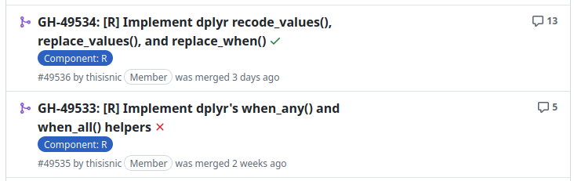

In this blog post, I explain how I used Claude Code to implement bindings to new dplyr functions in the Arrow R package.

I found that, while Claude Code generated the code, I still had a lot of the decision-making work as usual to do - reviewing, maintaining readability, and making sure we had enough validation and testing.  The difference for me was that I had to do fewer of the tedious aspects of implementation, like stepping through other examples.


## Background

The [Arrow R package](https://arrow.apache.org/docs/r/) contains bindings to dplyr functions, which means that users of arrow can work on their data using the same functions they're used to using in dplyr.

In [dplyr version 1.2.0](https://www.tidyverse.org/blog/2026/02/dplyr-1-2-0/), released in February 2026, some new functions were added; one example is `recode_values()`.  You can use it to create a new column by matching values and mapping them to replacements; for example, turning numeric codes into labels.  Here's an example:
```{r}
#| eval: true
#| echo: false
#| output: false
#| message: false

library(dplyr, warn.conflicts = FALSE)
```


```{r}
library(dplyr)

likert <- tibble(score = c(1, 3, 5, 2, 4))

likert |>
  mutate(
    category = score |>
      recode_values(
        1 ~ "Strongly disagree",
        2 ~ "Disagree",
        3 ~ "Neutral",
        4 ~ "Agree",
        5 ~ "Strongly agree"
      )
  )
```

I wanted to create bindings to these in Arrow, but they can be fiddly though.  In the past, to complete this task, I've typically ended up reading the code in the dplyr package, and then stepping through it one line at a time to understand it in depth, and then writing the arrow equivalent.  It's deep work and can be quite time-consuming, depending on how complex it is.

I wanted to see if I could use Claude Code to simplify this process.

## What I did

### Creating an initial version

I had Claude Code create an initial version.  It had access to the following things to help:

1. Access to the Arrow codebase (locally)
2. Access to the dplyr codebase (fetched from GitHub via the gh command line application)
3. A link to the [dplyr blog post](https://www.tidyverse.org/blog/2026/02/dplyr-1-2-0/) announcing the new functions
4. An "Arrow R dev skill" I set up which provides guidance for working with the Arrow R codebase and Arrow repository in general

It drafted the initial version, but there were a few problems:

1. The code turned off the [cyclomatic complexity linter](https://lintr.r-lib.org/reference/cyclocomp_linter.html) - this measures how complex code is and if there is too much complexity (often in nested if conditionals), we'll get a failure on the checks we run on CI.  These checks are important as they keep the code manageable and maintainable.
  
2. When skimming through the code, I noticed a lot of duplication.  We want code to be modular and not to have too much duplication, as these things make it easier to reason about.

3. Some of the produced utility functions were hard to skim-read and had minimal documentation.

### Expanding unit tests

I didn't jump straight to resolving these problems, as I first wanted to expand the testing.  The more tests we have, the more we can change the produced code automatically without ending up down a rabbit hole that won't work because we've broken some fundamental assumption.  To expand the tests, I had Claude read the dplyr tests and examples to see if there were any additions needed. 

This helped us spot a potential gap in where we validate the user's input, and so we added the test and updated the code.  In doing this, we also saw we needed to handle `NA` values better, accounting for more edge cases.

### Simplifying the initial version

After this, it was time to simplify the code.  A lot of this is down to individual taste - I skew towards being fairly strict on readability, and code that humans can reason about.

I want it to be so that a more junior developer could take on a task in this fairly complex codebase and have the best chance of success without overwhelming cognitive load.

I started by making sure the cyclomatic complexity linting was turned back on, and had Claude refactor some code out into utility functions.  They looked a bit weird, though it's hard to explain why - they had extra parameters which specified the environment in which they were to be executed, and it just felt like the wrong place for them.  It was drastically different to the rest of the codebase, and reminded me of how I often have to prompt Claude to be "idiomatic" - write code which fits in. 

Once this was solved, I prompted Claude to modularise things further, splitting out longer code chunks into individual functions.  These utility functions were still a little hard to understand at first glance, and so got Claude to add roxygen headers but using the tag `@keywords internal`, so they remained just as developer docs and wouldn't be included in our pkgdown site.

### Final tasks

Once I was happy with the shape of the code, I did a final manual review, and made sure we had test coverage for all the error conditions.  I spotted some duplication in input validation, and so simplified that too.

## Result

{fig-align="center"}

This took lots of rounds of manual review myself, but ultimately it meant that there was minimal review from others when I marked it "ready for review".  While I think it's fine to use AI tools for code changes and PRs like this, this shouldn't end up adding extra burden for the reviewer, and I wanted to make sure I really had properly read and engaged with the code before passing it onto someone else.

I'm not naturally good at this and have made tons of "obvious mistakes" in the past on entirely human-generated PRs - sometimes the feels of "being done" with a hard or long-running task is just too appealing.  Wanting to avoid "AI laziness", I made a real effort to tackle this here, and tried techniques like leaving lots of time between working intensely on the code and reviewing it myself.  Resetting my mental energy really helped.

I still found it hard to read every line, but having done so many iterative manual reviews and focusing on testing early gave me confidence that I'd done a proper job of this.  Honestly though, the fact I'd worked on this bit of the codebase without AI tools previously really helped.

## Future plans

I have a really exciting new project coming up soon, where I'll be working on a new codebase, and I don't plan to use AI for all of it.  I'm planning on reading code and writing notes myself, and trying first to fix a few bugs manually to understand the paths through the code, using tools like Claude to help me understand the source rather than to generate it, until I understand it better.  I'll write another blog post on the topic in a few months.