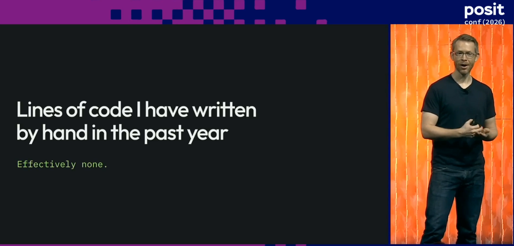
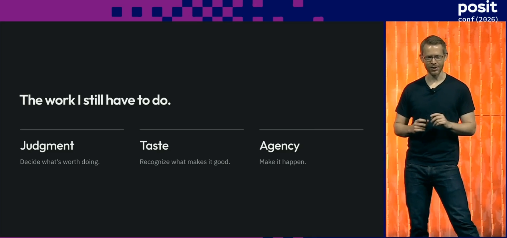

## The motivation

I'm a pretty heavy user of AI in my day-to-day open source maintenance, but with a lot of care and caveats. Generating code is easy, but the challenge these days lies in having confidence in the results - not just that they're correct, but that they fit in with existing design philosophy and won't have unintended consequences. As a result of this, my work has shifted from solving problems with code to reviewing code, and my biggest challenges now lie in managing cognitive load and decision fatigue.

I mostly work in R with some Python and C++, but one of my goals is to expand my skills into other languages.

Recently I was at [posit::conf](https://conf.posit.co/2026/) in Houston, watching Wes McKinney's keynote ["Navigating the Agentic Future"](https://posit.co/blog/posit-conf-2026-keynotes), in which he says

> "Over the last year I've built tons of software but written no lines of code by hand"

{fig-align="center"}

Wes also mentions that he's ended up shifting his focus to coding in languages which work well with agents, the most prevalent in his work is Go, describing himself as "an agentic Go programmer despite never having written a line of Go in \[his\] life".

At this point, I'm honestly feeling envy. My day-to-day open source maintenance works involves so much reading of mine and others' AI generated code, and so the prospect of productivity where my engagement is with aspects of the project other than code sounds...well, bloody delightful!

## What I built

And so I decided to take this and see where I could get to over the course of the rest of the day, armed with a Claude 5x Max plan and an attention span which was going to be mostly focused on watching talks.

I decided to build a simple [goal tracker app](https://github.com/thisisnic/goaltracker) which runs on the command line. It needed to be something I'd genuinely use, and it seemed like a good alternative to the website I was using for this kind of thing at the moment.

## The role of the human

So, if I'm not writing the code, what am I doing in this project?

In Wes' keynote, he mentions that there a 3 key remaining skills that programmers need to produce code which isn't just slop: judgment, taste, and agency.

{fig-align="center"}

In essence, judgment is deciding what is actually needed for the project without veering into unnecessary complexity and really understanding the constraints.  
Taste is about knowing whether the output is good or bad, with the failure mode here being decision fatigue.
Agency is about making it happen - the model can solve the problem, but the desire to solve it in the first place must come from a human.

The point about decision fatigue really resonated with me; recently I'd found myself in conversation with Claude learning about how air traffic controllers manage lapses in concentration to see if there were any techniques I could use in my open source work - taking regular breaks was as much as I took from it though.

## How I did it

I hadn't built this kind of thing before, and so I was concerned that both my judgment and taste may be lacking, but fortunately, I could outsource this.  Wes had been making a lot of useful Go utilities lately, all stored within the [Kenn Software organisation on GitHub](https://github.com/kenn-io).
I'm actually a regular user of one of them - [roborev](https://github.com/kenn-io/roborev) which provides "Continuous code review for AI coding agents".

I use roborev most days when coding; when initialised in a repo, when I make a commit, roborev automatically runs and has an agent perform a review of the code. I tend to use this manually for open source work, inspecting the roborev review before pushing the code to GitHub.

Here's an example roborev review from some work I did recently on [ellmer](https://ellmer.tidyverse.org).

```
Review #848 ellmer (claude-code: opus)
/home/nic/ellmer dirty on 1155-interactions
Verdict: Fail [33.5k ctx · 1.6k out · ~$0.22]

## Review Findings

• Severity: Low
• Location: R/provider-google-interactions.R:351
• Problem: The %||% list() fallback is added only at the value_turn() call site.
gemini_step_contents() still returns NULL when steps is missing or empty, or when no step produces
content, because list_c(list()) is c(), which is NULL. The other caller, stream_content() at line
638, therefore still gets NULL, and any new caller would hit the same trap. Nothing breaks today
because the stream path tolerates NULL, but the contract is inconsistent.
• Fix: Put the fallback inside gemini_step_contents(), e.g. list_c(...) %||% list(), and drop it
from value_turn(). That way every caller always gets a list.

--------

• Severity: Low
• Location: Rplots.pdf
• Problem: A stray graphics-device output file sits untracked in the package root. If it gets
committed by accident, it will also be flagged by R CMD check as a non-standard top-level file.
• Fix: Delete it, or add it to .gitignore and .Rbuildignore.

## Summary

value_turn() for ProviderGoogleGemini now returns an empty contents list instead of NULL when an
Interactions response has no steps (e.g. an incomplete status), and a new unit test covers that
case.
```

It's really helpful and regularly picks up mistakes, errors, or edge cases that the agent writing the code has missed - even with the most advanced models.

In this project roborev served as both a tool and a template.

I don't recall the exact prompt I used any more, but essentially, I set up a new directory, opened up a Claude session using Fable 5.1, and instructed it to ask me questions to figure out the minimal requirements needed to create an MVP goal tracker project.
I also told it to go take a look at the various projects in the Kenn Software organisation to use as a template in terms of approach, structure, and design.  
This way, although I'm not confident that I know what "good" looks like here, I can lean on the decisions that had been made in the design of roborev and other projects.

I then left the session running, with auto-accept turned on.  I told it to commit things incrementally, inspect the roborev reviews after every commit, and only pause when input was needed from me - this way the agent was being given continuous feedback on the code but my involvement was limited to design decisions.

I also specified a couple of other pieces of functionality I wanted here, like for the utility to be updated by running by a command like `goaltracker update`.  The idea here was to have something running smoothly before bolting on more features.

## What it was like

I then ignored it and let the agent run. It took most of the day to build the project, though most of that was due to me being busy and unable to provide input. It did use up over half of my Fable usage tokens for the week, so it was a resource intensive project.

I was curious about what I'd get - could I produce working software with this little input, or would it result in broken slop that would be more effort than it was worth to fix?

## The result

It actually worked terrifying well.  The [goaltracker](https://github.com/thisisnic/goaltracker) is fantastic and I use it weekly.  While at posit::conf I actually had it implement really customised features, like privacy mode - press the 'x' key while viewing the tracker and it would hide all certain fields - exactly something I needed while inputting my real data while at a conference.

Here's a preview of the interface.

```
goaltracker · goals
╭──────────────────────────────────────────────────╮╭──────────────────────────────────────────╮
│ 2026                                             ││ run 500 km                               │
│   2026     run 500 km                        43% ││ period 2026 (year)   id #1               │
│   ✓ 2026-Q2  run a half marathon                 ││                                          │
│   2026     finish the garden                     ││ why                                      │
│   ✓ 2026-04  plant the hedge                     ││ Be able to say yes to a long day out     │
│ 2027                                             ││ without thinking about it.               │
│   2027     swim 5 km in open water               ││                                          │
│                                                  ││ progress 215 km / 500 km                 │
│                                                  ││ █████████████████░░░░░░░░░░░░░░░░░░░░░░░ │
│                                                  ││                                          │
│                                                  ││ history                                  │
│                                                  ││   2026-03-31  120 km  end of March       │
│                                                  ││   2026-05-31  215 km  end of May         │
│                                                  ││                                          │
╰──────────────────────────────────────────────────╯╰──────────────────────────────────────────╯

a add · e edit · n notes · p progress · h hit · m missed · c clear · d delete · x private · j/k move · q quit
```
One of the things that I love about the utility is that while the UI above is a TUI - a terminal user interface for the human to interact with - it also was build with a CLI. This means that if I'm working with an agent session where it becomes relevant to update the data here, I can have the agent directly update it for me via the CLI.

## How does this compare to open source work?

This is very different from typical open source maintenance - the outcome here was much more important to me than the code itself.
Some of the lessons I learned here do transfer to my open source maintenance work though.
When I was building more complex features on a project, I'd been reviewing the agent's code output iteratively in chunks, but now I'm going to let it complete a full coding cycle with reviews and updates before engaging with the code.

It was an interesting experiment from the perspective of my development as a programmer as well. Usually with this kind of project, my aim is to acquire some new knowledge, but here I didn't learn anything much about Go at all. In this case, I learned how to approach agentic development and what was possible. I didn't necessarily develop any additional taste or judgment either.

This is radically different to the work I'm doing on Arrow, where I've been working on issue with how data is converted between Arrow types to R types via C++, and using this as an opportunity to learn about some of the [Arrow R package](https://arrow.apache.org/docs/r/)'s inner mechanisms that I'd never felt like I could spare the time to deep dive into. The difference here though is that I *need* this knowledge so that next time I use AI to work on a type conversion problem, I know enough to be able to review the generated code myself.

## Conclusions

I enjoyed my experiment - I since extended it to create a [task tracker utility](https://github.com/thisisnic/tasktracker) which I use to plan my work - and while I still need to be a lot more involved in the code I work with in my day-to-day work, it's great to know how easy it is to create utilities like this which can help me get things done.

I'd recommend checking out Wes' keynote when it's out on the Posit Youtube channel - I really appreciated how he links agentic coding to decades old software engineering theory and shows how it's still relevant today.
There are a lot of examples of his experiences on real projects have influenced his thinking, and is a really balanced take on the wins and losses of this new approach to development, and how the challenges encountered when writing code have changed immensely.

And in the meantime, check out this set of operating principles for coding agents which was referenced heavily in the talk: https://github.com/kenn-io/constitution/blob/main/CONSTITUTION.md

---

Photo by [Khitomi Michiru](https://unsplash.com/@egaomi) on [Unsplash](https://unsplash.com/photos/nGP4knVCJTc)
