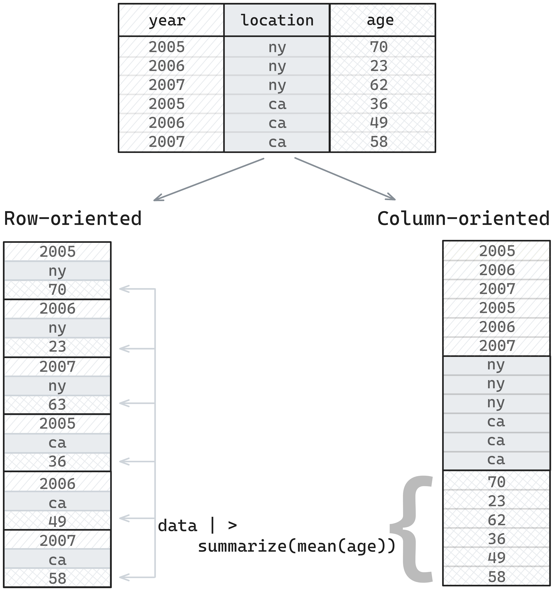

# Posit DS Lab - Parquet

Today I was on Posit's DS Lab talking about Parquet!  In this blog post, I've included the notes I wrote to prep for the session, which cover a lot of what we talked about today.  

## What is Parquet and why should you care?

- Smaller than equivalent CSV files so you can work with and share bigger datasets more easily
- Way faster to work with than CSVs
- Stores data types so less room for error or custom code needed to convert things when you read it in

## How?

- Smaller than equivalent CSV - internally uses encoding and compression and is a binary format (made for computers not humans)
- Faster - data stored in small pieces and in columns so can read efficiently and operate in parallel
- Data types - Parquet files store metadata internally about the data itself but also and how it's been saved

We'll look at these more closely later!

## What packages do I need to work with Parquet files?

Pick one of...

- [arrow](https://arrow.apache.org/docs/r/) - for all features, including working with multi-file datasets
- [nanoparquet](https://r-lib.github.io/nanoparquet/) - for a no-dependency package which has most (but not all) features but can be slower on larger datasets
- [duckdb](https://r-duckdb.org/) - for SQL-oriented workflows

Today we'll focus on {arrow} but some examples with {nanoparquet}

### Using {arrow} vs. using {nanoparquet}

| | {arrow} | {nanoparquet} |
|---|---|---|
| Dependencies | C++ library (pre-built binaries available) | None |
| Read/write single files | ✅ | ✅ |
| Multi-file & partitioned datasets | ✅ | ❌ |
| Larger-than-memory data | ✅ | ❌ |
| Remote files (S3, HTTP) | ✅ | ❌ |
| Filter rows before reading | ✅ | ❌ |
| Append to existing files | ❌ | ✅ |
| Full Parquet type support | ✅ | Most types |
| Nested types (lists of lists) | ✅ | ❌ |

The `arrow` package contains the full functionality, but `nanoparquet` is great when you have small files and really simple use cases or want to append data to an existing Parquet file.

## How do you open a Parquet file?

 You can use `read_parquet()` from `arrow` (or `nanoarrow`!)

```{r read-parquet}
library(arrow)
library(tibble)

taxi <- read_parquet(
  "https://arrow-datasets.s3.amazonaws.com/nyc-taxi-tiny/year=2019/month=1/part-0.parquet"
)
# Below is the same file but locally
taxi <- read_parquet("taxi-mini.parquet")

# it's read in as a tibble automatically
class(taxi)

taxi
```

## How do you save a Parquet file?

Use `write_parquet()` from `arrow` (same name in `nanoarrow`!)

```{r write-parquet}
write_parquet(taxi, "new_taxi.parquet")
```

### Size/speed compared to CSVs

What if we're working with a really big Parquet file? This one is 135MB.

```{r read-big-parquet}
# fs <- S3FileSystem$create(anonymous = TRUE)
# df <- read_parquet(fs$path("arrow-datasets/nyc-taxi/year=2019/month=1/part-0.parquet"))
# write_parquet(df, "taxi.parquet")
taxi_big <- read_parquet("taxi.parquet")
nrow(taxi_big)
```
```{r parquet-file-size}
fs::file_size("taxi.parquet")
```

If we write it to CSV, how long does it take? 

```{r write-csv-timing}
library(tictoc)
tic()
readr::write_csv(taxi_big, "taxi_big.csv")
toc()
```

It took a while last time I tried! And, how big is the CSV?

```{r csv-file-size}
fs::file_size("taxi_big.csv")
```

From 135MB to 924MB!

And how long does it take to read the whole file?

```{r read-csv-timing}
tic()
from_csv <- readr::read_csv("taxi_big.csv")
toc()
```

```{r read-parquet-timing}
tic()
from_parquet <- read_parquet("taxi.parquet")
toc()
```

Waaay faster!  And what if we only want data from certain columns?

```{r col-select-timing}
tic()
just_times <- read_parquet("taxi.parquet", col_select = c(pickup_datetime, dropoff_datetime))
toc()
```
Even faster!

### Data types in Parquet files

Parquet has its own data types so it can be language-agnostic. In other words, files you write in one R can be read in Python, Java, Rust, etc, and vice versa.

The Arrow R package handles the mapping between R types and Parquet types automatically, which means you can read and write data to/from Parquet files in R and it'll remain the same.

### Why do types matter?

#### 1. Ambiguous data

Let's say I have a data frame containing zip codes.  When I first create it, it's character data in R.

```{r zip-create}
zip_data <- data.frame(state = c("New York", "New Jersey"), zip = c("11213", "07001"))
zip_data
```

But what if I write it to a CSV and read it back into R?

```{r zip-csv-roundtrip}
write.csv(zip_data, "zip.csv", row.names = FALSE)
read.csv("zip.csv")
```

The CSV reader has tried to guess the type and assumed it's an integer and so we miss the leading 0 from the New Jersey zip.

If we look at the raw CSV file, it's actually been saved as a string.

```
"state","zip"
"New York","11213"
"New Jersey","07001"
```

But as CSV readers have to guess data types, it's extra work. Luckily I know that `readr` has a CSV reader which handles things better.

```{r zip-readr}
library(readr)
read_csv("zip.csv")
```

But I'd rather not have to know this! And what if I'm collaborating with people and sharing data and so they might read it in with the base R one and our data gets messed up.

With Parquet, storing the data type with the data means that we're always going to get the correct type.

```{r zip-parquet-roundtrip}
write_parquet(zip_data, "zip.parquet")
read_parquet("zip.parquet")
```

#### 2. Ordered factors

The diamonds dataset from ggplot2 has `cut` as an ordered factor. Easy to plot `cut` in order when we load the dataset directly from the ggplot2 package data.

```{r diamonds-ordered-plot}
library(ggplot2)
ggplot(diamonds, aes(x = cut)) + geom_bar() + theme_minimal()
```

But in real life we do a lot more loading of data from files, so what happens if we save the data to a CSV and load it back in before plotting it?

```{r diamonds-csv-roundtrip}
library(readr)

write_csv(diamonds, "diamonds.csv")
diamonds_from_csv <- read_csv("diamonds.csv")

ggplot(diamonds_from_csv, aes(x = cut)) + geom_bar() + theme_minimal()
```

CSV files don't have any concept of ordered factors - data is just saved as strings and so we'd need to tell R that `cut` is an ordered factor before plotting it to get it right.  But, Parquet saves data types and so we can write the data to Parquet and back to R and it keep track of the fact it's an ordered factor.

```{r diamonds-parquet-roundtrip}
library(arrow)

write_parquet(diamonds, "diamonds.parquet")
diamonds_from_parquet <- read_parquet("diamonds.parquet")

ggplot(diamonds_from_parquet, aes(x = cut)) + geom_bar() + theme_minimal()
```

#### 3. List columns

And what about reading/writing list columns? Here's one from the starwars dataset from dplyr.

```{r starwars-list-col}
library(dplyr)
starwars_subset <- starwars |> select(name, films)
starwars_subset
```

Base R gets us an error

```{r starwars-csv-base}
#| error: true
starwars_subset |>
  write.csv("starsub.csv")

read.csv("starsub.csv")
```

With readr the data is gone.

```{r starwars-csv-readr}
starwars_subset |>
  write_csv("starsub.csv")

starsub_csv <- read_csv("starsub.csv")
starsub_csv$films[1]
```

We could transform it into e.g. a single string separated by semi-colons before writing and extract it into columns after reading, but with parquet, it's preserved.

```{r starwars-parquet-roundtrip}
starwars_subset |>
  write_parquet("starsub.parquet")

starsub_parquet <- read_parquet("starsub.parquet")

starsub_parquet$films[1]
```

### How do R types map to Arrow types (and vice versa)

These docs, written by Danielle Navarro have excellent information about translation between types:

<https://arrow.apache.org/docs/r/articles/data_types.html#list-of-default-translations>

### Column-oriented

If we think about how data is stored in memory, it's in a one-dimension structure - one value after another.

When we are doing analytics, we're typically asking questions like, "what's the mean value of this column", or "show me only values greater than X", and so we're thinking about things in terms of taking data from a column and doing something with it.

If data is stored in a *row-oriented* format, we need to skip between different places to retrieve values for a column, but if data is stored in a *column-oriented* format, we can just pull retrieve the chunk where our data is stored, which is more efficient.



### Parquet file chunking

A Parquet file is divided into smaller components.

- rowgroups, which contain...
- column chunks, which contain...
- pages

They also contain metadata in the footer


### Parquet file footers

The footer is the key to how Parquet files work. It the last thing that's written to the file when saving a file, but the first thing which is read when it's being read.

It contains:

1. The schema - the column name/type mapping
2. Metadata for the rowgroups - where they are in the file and what encoding/compression is used; this makes it faster to read subsets
3. Statistics - things like minimum and maximum values for columns, and how many null values - so if you're filtering, something like Arrow can use this to skip certain sections, or count rows without too much effort
4. Additional metadata - like the Arrow-equivalent schema, or in Python, pandas metadata


## Reading Parquet metadata

You can do this using the nanoparquet package!

```{r parquet-info}
nanoparquet::read_parquet_info("taxi-mini.parquet")
```

```{r parquet-schema}
nanoparquet::read_parquet_schema("taxi-mini.parquet")
```

```{r parquet-pages}
nanoparquet:::read_parquet_pages("taxi-mini.parquet")
```

Disclaimer: prose below here was generated with Claude, but checked by me.

## Arrow vs. Parquet vs. Feather

This is the distinction that confuses everyone:

- **Parquet** = a file format for storing data on disk (columnar, compressed, self-describing)
- **Arrow columnar format** = a specification for how columnar data is laid out in memory - designed for zero-copy reads and fast analytics. Multiple implementations exist across languages (C++, Rust, Java, Go, etc.)
- **Arrow IPC format** = a way to write Arrow-formatted data to disk or send it between processes, preserving the in-memory layout. Very fast to read because there's no decoding step - the data on disk is already in Arrow format
- **Feather** = an older name for Arrow IPC files (V1 is deprecated; V2 = Arrow IPC)
- **The {arrow} R package** = an R interface to the Arrow C++ library, giving you tools to read/write Parquet, Arrow IPC, and CSV files, plus a dplyr backend for larger-than-memory data

In practice: Parquet is the best default for storing and sharing data. Arrow IPC can be faster to read/write but files are larger and less widely supported outside the Arrow ecosystem.

## What you can and can't store in Parquet

All standard R types (numeric, integer, character, logical, Date, POSIXct), list columns, and factor levels can be stored in Parquet. Custom R classes are preserved via metadata when round-tripping in R.

Nested data example - list columns survive the round-trip:

```{r nested-roundtrip}
nested_data <- tibble(
  species = c("cat", "dog", "bird"),
  sounds  = list(
    c("meow", "purr", "hiss"),
    c("woof", "bark", "growl"),
    c("tweet", "squawk")
  )
)

write_parquet(nested_data, "nested.parquet")
read_parquet("nested.parquet")
```

What you **can't** store:

- Arbitrary R objects (ggplot objects, model fits, environments)
- Everything must map to Parquet's type system
- Custom R class metadata is R-specific (won't auto-translate to Python)

## Partitioning

Partitioning splits a dataset into separate files based on column values. When you filter, Arrow only reads the relevant files.

```{r partition-write}
write_dataset(
  taxi_big,
  path = "taxi-partitioned",
  format = "parquet",
  partitioning = "payment_type"
)

list.files("taxi-partitioned", recursive = TRUE)
```

```{r partition-read}
taxi_ds <- open_dataset("taxi-partitioned")

taxi_ds |>
  filter(payment_type == "Credit card") |>
  summarise(avg_tip = mean(tip_amount, na.rm = TRUE)) |>
  collect()
```

Rules of thumb for partitioning:

- Partition on columns you frequently filter by
- Aim for individual files between 20 MB and 2 GB
- Avoid more than ~10,000 partition files

## Bonus: analysing with Arrow

You can use dplyr verbs on an Arrow dataset - the work happens in Arrow, not R, until you `collect()`.

```{r bonus-analysis}
taxi_ds <- open_dataset("taxi-partitioned")

taxi_ds |>
  filter(trip_distance > 0, fare_amount > 0) |>
  group_by(payment_type) |>
  summarise(
    n = n(),
    avg_fare = mean(fare_amount, na.rm = TRUE),
    avg_tip = mean(tip_amount, na.rm = TRUE)
  ) |>
  collect()
```

For much more on this, see [Scaling Up With R and Arrow](https://arrowrbook.com/).

## Where can I read more?

- [Scaling Up With R and Arrow](https://arrowrbook.com/) - free online book
- [R for Data Science: Arrow chapter](https://r4ds.hadley.nz/arrow)
- [Arrow R package docs](https://arrow.apache.org/docs/r/)
- [posit::conf(2024) Arrow workshop](https://posit-conf-2024.github.io/arrow/)
- [nanoparquet](https://nanoparquet.r-lib.org/)
