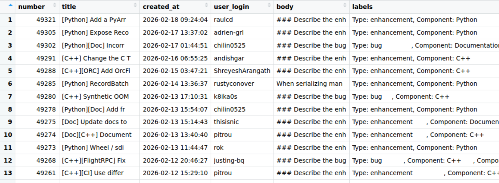

In this post, I demonstrate how simple LLM tools can be used for open source issue triage.

## Background

The Apache Arrow repository contains multiple implementations of Arrow. Both Python and R implementations are wrappers around the C++ implementation. Although many developers work across multiple languages, triage of new issues tends to be done by individuals more aligned to an individual language.

We use labels in the Apache arrow repository to identify which implementation an issue relates to. Our issue creation workflow does make users select a component (e.g. "Python", "R", "C++" etc), but on occasion, new issues are opened by users via a different route with the component label missing.

The problem here is that many maintainers will filter issues by component and so unlabeled issues can end up completely ignored. The problem that I want to solve here is whether we can automatically classify issues by component by passing the text in the issue to an LLM, so that we can potentially automate labelling of new issues so they get responded to appropriately.

## Loading the data

The first thing that I need to do is get hold of the data. I wrote a script that retrieves issues from the GitHub API and caches them in Parquet files. Parquet is an excellent format for this because it is efficient for storage in terms of space, and unlike CSV files allows nested columns. This means that when you retrieve data from an API in JSON format there's potentially less work to do to get it into a good state for storage.

Here's a quick preview of the dataset. 



The important column here for us is the `labels` column, which is a list column containing 0 or more labels.  R, Python, and C++ issues all have labels like "Component: Python".  Although the issue titles have the component at the start of their title and also included in their body, this is automatically added based on the label, so isn't helpful to our problem.

My plan is to extract a subset of C++/Python/R component tickets, remove the autogenerated "component" label that gets added to the body of the ticket, and see if I can get an LLM to classify the component based on the content of the issue body.

Let's extract a subset of \~30 of each.

```{r}
#| echo: true
#| eval: false
library(dplyr)
target_labels <- c("Component: C++", "Component: R", "Component: Python")

issues_with_components <- data |>
    select(number, title, body, labels) |>
    # make sure we match our target label
    filter(purrr::map_lgl(labels, ~ any(.x %in% target_labels))) |>
    # make sure we have code in the PR body
    filter(stringr::str_detect(body, "```")) |>
    # create new column containing only component labels
    mutate(component = purrr::map(labels, ~ .x[.x %in% target_labels])) |>
    # filter to only keep rows where we have a single component
    filter(purrr::map_int(component, length) == 1) |>
    # convert from list to character column
    mutate(component = purrr::map_chr(component, 1)) |>
    # Remove "Component prefix"
    mutate(component = stringr::str_remove(component, "Component: ")) |>
    # Remove the bit in the body where the "component" has been auto-appended
    mutate(body = stringr::str_remove(body, "### Component\\(s\\).*$"))
```

I want to create a smaller data set to test the LLM classification on simply because I don't have any idea at this point on how long it'll take or how much it'll cost. The next step is to create a dataset containing 30 issues from each component.

I'll store this intermediate version to work with later too.

```{r}
#| eval: false
#| echo: true
r_issues <- issues_with_components |>
    filter(component == "R") 

python_issues <- issues_with_components |>
    filter(component == "Python") 

cpp_issues <- issues_with_components |>
    filter(component == "C++") 

issues_dataset <- bind_rows(
    r_issues |> slice_head(n = 30),
    python_issues |> slice_head(n = 30),
    cpp_issues |> slice_head(n = 30)
)

# shuffle the dataset
issues_dataset <- issues_dataset |>
     slice_sample(prop = 1)
```

```{r}
#| eval: false
#| echo: false
# only rerun this if we rerun the analysis
readr::write_csv(issues_dataset, "./issues_dataset.csv")
```

```{r}
#| echo: false
#| eval: true
#| cache: true
readr::read_csv("./issues_dataset.csv", show_col_types = FALSE)
```

## LLM classification

Before we properly get started, I'm going to have a look at an individual example.

Let's have a quick look at the first issue in the data set

```{r}
#| eval: true
#| echo: false
#| message: false
#| warning: false
library(dplyr)
issues_dataset <- readr::read_csv("./issues_dataset.csv")
```

```{r}
#| cache: true
issues_dataset |> slice(1)
```

Ok, so I can see from the title that it's an R function.  I'll paste it below so you can see it.


::: {.callout-note collapse="true" title="First issue body"}
```{r}
#| echo: false
#| cache: true
issues_dataset |>
    slice(1) |>
    pull(body) |>
    cat()
```
:::

And now let's try classifying it. Here I'm going to start a new conversation, and then use structured output so that I can determine the exact response type I get from the LLM. In this case I'm using enumerated values so I can guarantee that we get one of the pre-specified values back and nothing else.

```{r}
#| eval: true
#| echo: true
#| cache: true
library(ellmer)
chat <- chat_anthropic()

type_language <- type_enum(values = c("Python", "C++", "R"), "The language implementation of Arrow that the issue relates to")

chat$chat_structured(issues_dataset$body[1], type = type_language)
```

Great! This was successful so now I'm going to try running it on the rest of the data set. In the above code I just use the default model that `ellmer` is configured to use, which turned out to be Claude Sonnet 4.5, but actually I want to use the cheapest option to see how well it performs.

Let's have a look at which Anthropic models are available to us in `ellmer`.

```{r}
#| cache: true
models_anthropic()
```

I'm gonna go for the Haiku model and this time I'm gonna do things a little bit differently to do the classification across the whole data set.

I could try writing a loop of some sort, but it'll be slow, and so I'm gonna use the function `parallel_chat_structured()` so that I can start a new conversation for each individual issue classification task, and run them in parallel so it takes less time.

```{r}
#| eval: false
#| echo: true
haiku_chat <- chat_anthropic(model = "claude-3-haiku-20240307")

haiku_classified <- parallel_chat_structured(
    chat = haiku_chat,
    prompts = as.list(issues_dataset$body),
    type = type_language
)
```

I was surprised to see a message "waiting 35s for rate limiting" when it ran but after diving deeper into the Claude [developer docs](https://platform.claude.com/docs/en/api/rate-limits#tier-1) I realised that I'd hit the 50 requests per minute limit. Pretty simple to limit in the function call, but not need as waiting wasn't a problem.

```{r}
#| eval: true
#| echo: false
#| cache: true
haiku_classified <- structure(c(3L, 1L, 1L, 1L, 3L, 1L, 3L, 1L, 3L, 3L, 2L, 1L, 2L, 
3L, 3L, 1L, 3L, 1L, 1L, 1L, 1L, 1L, 3L, 3L, 3L, 1L, 2L, 2L, 3L, 
3L, 2L, 3L, 3L, 3L, 2L, 2L, 1L, 1L, 2L, 1L, 1L, 2L, 2L, 2L, 2L, 
2L, 1L, 3L, 1L, 1L, 1L, 2L, 2L, 3L, 2L, 1L, 3L, 3L, 2L, 3L, 3L, 
2L, 2L, 2L, 3L, 1L, 3L, 3L, 2L, 1L, 2L, 1L, 3L, 2L, 3L, 1L, 3L, 
3L, 2L, 1L, 2L, 1L, 2L, 1L, 1L, 1L, 1L, 1L, 2L, 3L), levels = c("Python", 
"C++", "R"), class = "factor")
```


I also wanted to check how much it had cost - \$0.04 in total, and some of this was earlier experimentation I had done in the process.

```{r}
#| eval: false
#| echo: true
token_usage()
```

```{r}
#| eval: true
#| echo: false
#| cache: true
structure(list(provider = c("Anthropic", "Anthropic"), model = c("claude-sonnet-4-5-20250929", 
"claude-3-haiku-20240307"), input = c(3795, 136299.5), output = c(503, 
2996), cached_input = c(0, 0), price = structure(c(0.01893, 0.037819875
), class = c("ellmer_dollars", "numeric"))), row.names = c(NA, 
-2L), class = "data.frame")
```

Now I'd run it successfully with Haiku, I wanted to check the quality of the results. I'm just going to use a very rough measure of how many were a perfect match.

```{r}
#| eval: true
#| echo: true
#| cache: true
issues_dataset$llm_component <- haiku_classified
mean(issues_dataset$llm_component == issues_dataset$component, na.rm = TRUE) |> round(2)
```

OK, so this is great; 97% accuracy!

And how about the ones it got wrong? Let's take a look!

```{r}
#| eval: true
#| echo: true
#| cache: true
issues_dataset |>
    filter(llm_component != component)
```

OK, so 3 C++ tickets incorrectly classified as Python. Let's have a look at each issue body.

::: {.callout-note collapse="true" title="Issue 1 body"}
```{r}
#| echo: false
#| cache: true
issues_dataset |>
    filter(llm_component != component) |>
    slice(1) |>
    pull(body) |>
    cat()
```
:::

Ok, so here the issue is the fact that the problem was detected in the Python library, which wraps the C++ library. The user who opened this ticket had a sophisticated enough level of knowledge to understand that link, and so rather than classifying this as an incorrect response, I'd actually probably call this example not typical of where we actually want to apply the model and so just not a good example for our test data set. Most unlabelled tickets come from new users who don't have a deep understanding of the interplay between the different components. Let's take a look at another example.

::: {.callout-note collapse="true" title="Issue 2 body"}
```{r}
#| echo: false
#| cache: true
issues_dataset |>
    filter(llm_component != component) |>
    slice(2) |>
    pull(body) |>
    cat()
```
:::

Again, a more complex example, identified in PyArrow but relating to C++.

And the third?

::: {.callout-note collapse="true" title="Issue 3 body"}
```{r}
#| echo: false
#| cache: true
issues_dataset |>
    filter(llm_component != component) |>
    slice(3) |>
    pull(body) |>
    cat()
```
:::

Same again!

Given that these kinds of issues are typically reported by more experienced contributors and don't end up going unlabelled anyway, we could justifiably deem them to be poor examples for the task at hand and so claim 100% accuracy here.

I'm calling this experiment a success and my next steps are to see if I can deploy this or something similar to help with other aspects of Apache Arrow maintenance. The main thing I took from this is how accessible LLM-powered tooling has become and how simple it has been to use for an otherwise manual task.

I've just finished writing a course about how to work with ellmer and extract tidy data from text, and create chatbots; if this is something you're interested in learning about with step-by-step tutorials, you can find my course at: <https://www.aifordatapeople.com/courses/llms-in-r>.