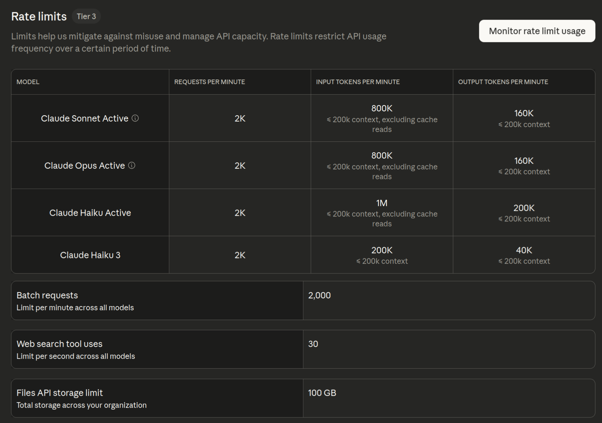

The Apache Arrow repository contains multiple implementations of Arrow. Both Python and R implementations are wrappers around the C++ implementation. although many developers work across multiple languages, triage of new issues tends to be done by individuals more aligned to an individual language. for example, most of the triage for R issues tends to be done by myself and Jonathan Keane.

We use labels in the Apache arrow repository to identify which implementation an issue relates to. our new issue workflow does make users select a component, so that will be Python, R, C++, or something else but on occasion, new issues are opened by users who don't use our component labels.

The problem here is that many maintainers will filter issues by component and so unlabeled issues can go completely ignored. The problem that I want to solve here is whether we can automatically classify issues by component by passing the text in the issue to an LLM.

If this is possible, this means that we can potentially automate labelling of new issues so they get responded to appropriately.

The first thing that I need to do is load the data. I wrote a script that retrieves issues from the GitHub API and caches them in parquet files. Parquet is an excellent format for this because it is efficient for storage in terms of space, and unlike CSV files allows nested columns. This means that when you retrieve data from an API in JSON format there's potentially less work to do to get it into a good state for storage.

I'll write about this in another blog post, but for now, here I load in the dataset.

```{r}
#| eval: true
#| echo: false
# Step 1: Get dataset of existing issues (and explain its source)
library(arrow)
data <- arrow::read_parquet("issue_details.parquet")
data
```

this is the raw data, so actually let's take a look at what are the different component labels in the data set?

```{r}
# What are the unique labels for different components?
library(dplyr)
data |>
  select(labels) |>
  tidyr::unnest(labels) |>
  distinct() |>
  filter(stringr::str_detect(labels, "^Component")) |>
  pull(labels)
```

Some of these Arrow implementations have moved to their own repository, or are not language-related ones. We'll focus on the main ones I work in, which are C++, Python, and R. Let's extract a subset of \~30 of each.

```{r}
target_labels <- c("Component: C++", "Component: R", "Component: Python")

issues_with_components <- data |>
    select(number, title, body, labels) |>
    # make sure we match our target label
    filter(purrr::map_lgl(labels, ~ any(.x %in% target_labels))) |>
    # make sure we have code in the PR body
    filter(stringr::str_detect(body, "```")) |>
    # create new column containing only component labels
    mutate(component = purrr::map(labels, ~ .x[.x %in% target_labels])) |>
    # filter to only keep rows where we have a single component
    filter(purrr::map_int(component, length) == 1) |>
    # convert from list to character column
    mutate(component = purrr::map_chr(component, 1)) |>
    # Remove "Component prefix"
    mutate(component = stringr::str_remove(component, "Component: ")) |>
    # Remove the bit in the body where the "component" has been auto-appended
    mutate(body = stringr::str_remove(body, "### Component\\(s\\).*$"))

issues_with_components
```

I want to create a smaller data set to test the LLM classification on simply because I don't have any idea at this point on how long it'll take or how much it'll cost. The next step is to create a dataset containing 30 issues from each component.

I'll store this intermediate version to work with later too.

```{r}
#| eval: false
#| echo: true
r_issues <- issues_with_components |>
    filter(component == "R") 

python_issues <- issues_with_components |>
    filter(component == "Python") 

cpp_issues <- issues_with_components |>
    filter(component == "C++") 

issues_dataset <- bind_rows(
    r_issues |> slice_head(n = 30),
    python_issues |> slice_head(n = 30),
    cpp_issues |> slice_head(n = 30)
)
```

```{r}
#| eval: false
#| echo: false
# shuffle the dataset
issues_dataset <- issues_dataset |>
     slice_sample(prop = 1)

readr::write_csv(issues_dataset, "./issues_dataset.csv")
```

# Step 3: Use LLM to classify them

Before we properly got started I'm going to just have a look at an individual example.

Let's have a quick look at the first issue in the data set

```{r}
#| eval: true
#| echo: false
issues_dataset <- readr::read_csv("./issues_dataset.csv")
```

```{r}
issues_dataset |> slice(1)
```

ok, so I can see from the title but it's an r function.

and now let's try classifying it. here I'm going to start a new conversation, and then use structured output so that I can determine the exact response type I get from the LLM. In this case I'm using enumerated values so I can guarantee that we get one of the pre-specified values back and nothing else.

```{r}
#| eval: false
#| echo: true
library(ellmer)
chat <- chat_anthropic()

type_language <- type_enum(values = c("Python", "C++", "R"), "The language implementation of Arrow that the issue relates to")

chat$chat_structured(issues_dataset$body[1], type = type_language)
```

Great! This was successful so now I'm going to try running it on the rest of the data set. In the above code I just use the default model that `ellmer` is configured to use, which turned out to be Claude Sonnet 4.5, but actually I want to use the cheapest option to see how well it performs.

Let's have a look at which Anthropic models are available to us in `ellmer`.

```{r}
models_anthropic()
```

I'm gonna go for the Haiku model and this time I'm gonna do things a little bit differently to do the classification across the whole data set.

I could try writing a loop of some sort, but it'll be slow, and so I'm gonna use the function `parallel_chat_structured()` so that I can start a new conversation for each individual issue classification task, and run them in parallel so it takes less time.

```{r}
#| eval: false
#| echo: true
haiku_chat <- chat_anthropic(model = "claude-3-haiku-20240307")

haiku_classified <- parallel_chat_structured(
    chat = haiku_chat,
    prompts = as.list(issues_dataset$body),
    type = type_language
)
```

I was surprised to see a message "waiting 35s for rate limiting" when it ran and upon inspecting my limits in the Claude Console, I don't think I hit it, so perhaps a behaviour from `ellmer` there? Hard to tell!



I also wanted to check how much it had cost - \$0.04 in total.

```{r}
#| eval: false
#| echo: true
token_usage()
```

```{r}
#| eval: true
#| echo: false
structure(list(provider = c("Anthropic", "Anthropic"), model = c("claude-sonnet-4-5-20250929", 
"claude-3-haiku-20240307"), input = c(3795, 136299.5), output = c(503, 
2996), cached_input = c(0, 0), price = structure(c(0.01893, 0.037819875
), class = c("ellmer_dollars", "numeric"))), row.names = c(NA, 
-2L), class = "data.frame")
```

Now I'd run it successfully with Haiku, I wanted to check the quality of the results. I'm just going to use a very rough measure of how many were a perfect match.

```{r}
#| eval: false
#| echo: true
issues_dataset$llm_component <- haiku_classified
mean(issues_dataset$llm_component == issues_dataset$component, na.rm = TRUE) |> round(2)
```

```{r}
#| eval: true
#| echo: false
0.96
```

OK, so this is great; 95% accuracy!

And how about the ones it got wrong? Let's take a look!

```{r}
#| eval: false
#| echo: true
issues_dataset |>
    filter(llm_component != component)
```

```{r}
#| eval: true
#| echo: false
structure(
  list(
    number = 48761L,
    title = "[C++] Substrait serialised expression size increases exponentially due to extension URIs being repeated",
    body = "### Describe the bug, including details regarding any error messages, version, and platform.\n\nWhen serialising pyarrow expressions using substrait, the size of the serialised buffer increases exponentially with the number of binary operation clauses in the expression due to extension URIs being repeated again for each nested expression.  \n\nTesting with pyarrow 21.0.0: \n```\n================================================================================\nTesting with 1 OR condition(s)\n================================================================================\nExpression:  (int_col == 1)\nSubstrait size: 201 bytes\nTotal extension URIs: 1\n\n================================================================================\nTesting with 2 OR condition(s)\n================================================================================\nExpression:  ((int_col == 1) or (int_col == 2))\nSubstrait size: 634 bytes\nTotal extension URIs: 5\n\n================================================================================\nTesting with 4 OR condition(s)\n================================================================================\nExpression:  ((((int_col == 1) or (int_col == 2)) or (int_col == 3)) or (int_col == 4))\nSubstrait size: 2967 bytes\nTotal extension URIs: 29\n\n================================================================================\nTesting with 6 OR condition(s)\n================================================================================\nExpression:  ((((((int_col == 1) or (int_col == 2)) or (int_col == 3)) or (int_col == 4)) or (int_col == 5)) or (int_col == 6))\nSubstrait size: 12017 bytes\nTotal extension URIs: 125\n\n================================================================================\nTesting with 8 OR condition(s)\n================================================================================\nExpression:  ((((((((int_col == 1) or (int_col == 2)) or (int_col == 3)) or (int_col == 4)) or (int_col == 5 ... ",
    labels = structure(list(c("Type: bug", "Component: C++")), ptype = character(0), class = c("arrow_list", 
    "vctrs_list_of", "vctrs_vctr", "list")), component = "C++", 
    llm_component = structure(1L, levels = c("Python", "C++", 
    "R"), class = "factor")), row.names = c(NA, -1L), class = c("tbl_df", 
"tbl", "data.frame"))
```

OK, so 1 C++ tickets incorrectly classified as Python. Let's have a look at the issue body.

```{r}
issues_dataset |>
    filter(llm_component != component) |>
    slice(1) |>
    pull(body) |>
    cat()
```

ok, so here the issue is the fact that The problem was detected in the Python library, which wraps the C++ library. The user who opened this ticket had a sophisticated enough level of knowledge to understand that link and so rather than classifying this as an incorrect response, I'd actually probably call this example not typical of where we actually want to apply the model and so just not a good example for our test data set. most unlabeled tickets come from new users who don't have a deep understanding of the interplay between the different components. let's take a look at another example

```{r}
issues_dataset |>
    filter(llm_component != component) |>
    slice(2) |>
    pull(body) |>
    cat()
```

ok, so this one does look like a straight up error.

For the sake of brevity, I won't paste the other two examples here, but upon inspecting them, they both contain Python code. so come at another words our component classifier only really got 1 example wrong.

So what's next? I could try to iterate further and improve my prompting to tease out the details of when a Python ticket is concerned with the underlying C++, rather than just Python, but I don't feel like this is going to be a good use of my time.

One thing that I did miss out on doing here is allowing the LOM to say " I don't know" which I can do by setting a parameter in the type specification called `required` to `FALSE` which will mean if the LLM is unsure then it doesn't have to return a response. that said, it wouldn't have helped with the 3 incorrect answers above which contained Python code.

Even at the conservative estimate of 96% accuracy, I'm considering this a success.
